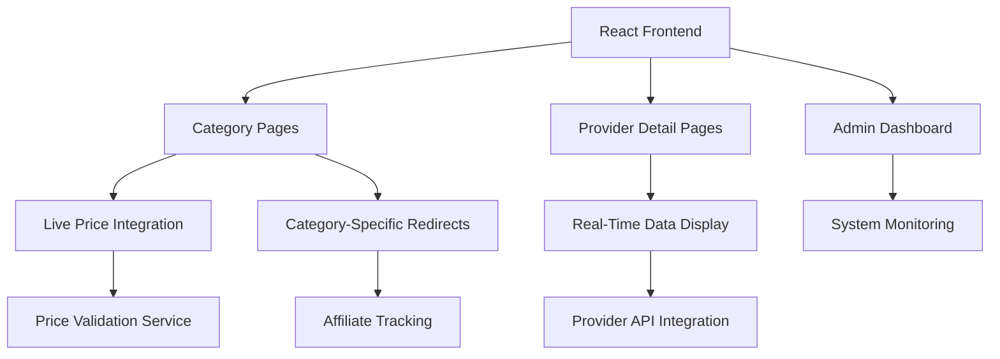
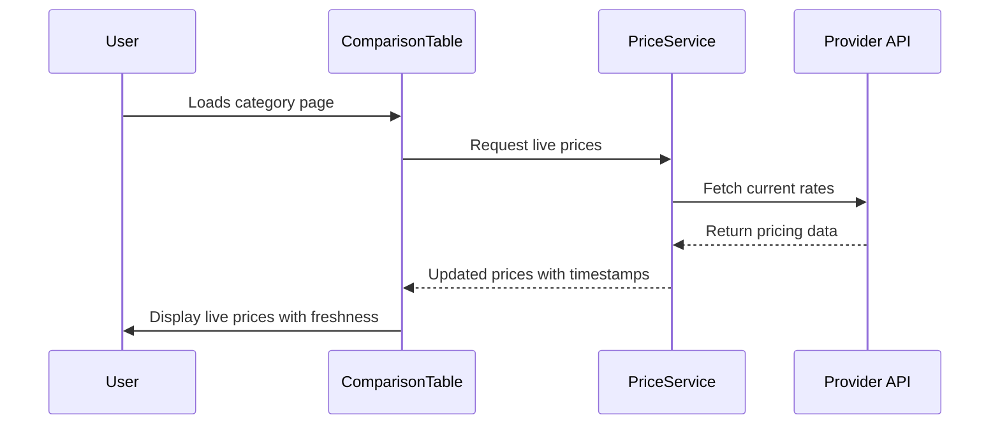
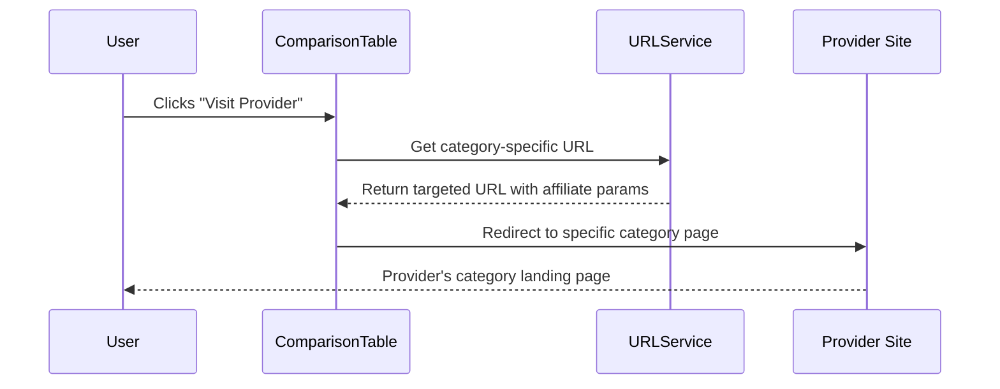

# Skygruppen Compare Pro - Technical Documentation

## Overview

Skygruppen Compare Pro is a comprehensive Norwegian provider comparison platform built with React, TypeScript, and Tailwind CSS. The platform enables real-time comparison of providers across insurance, electricity, mobile plans, and loans with live pricing and direct category redirection.

## Architecture Overview



## Core Features

### 1. Live Price Synchronization
- **Real-time pricing**: Prices are synchronized with provider websites
- **Freshness indicators**: Shows when prices were last updated
- **Price validation**: Ensures accuracy between our platform and provider sites
- **Fallback mechanisms**: Graceful handling of price fetch failures

### 2. Category-Specific Redirections
- **Direct navigation**: Users are redirected to specific category pages on provider websites
- **Affiliate tracking**: All redirections include proper affiliate parameters
- **Category mapping**: Each provider has dedicated URLs for different service categories

### 3. Mobile-First Design
- **Responsive layouts**: Card-based mobile view, table-based desktop view
- **Touch-friendly interface**: Optimized for mobile interactions
- **Adaptive navigation**: Hamburger menu and mobile-optimized components

## Project Structure

```
src/
├── components/
│   ├── ComparisonTable.tsx     # Main comparison interface
│   ├── ProviderDetail.tsx      # Individual provider pages
│   ├── Layout.tsx              # Site layout wrapper
│   └── ui/                     # Shadcn/ui components
├── data/
│   ├── mockProviders.ts        # Provider data with category URLs
│   └── mockErrorLogs.ts        # System monitoring data
├── pages/
│   ├── Index.tsx               # Homepage
│   ├── CategoryPage.tsx        # Category comparison pages
│   ├── ProviderDetailPage.tsx  # Provider detail wrapper
│   └── AdminDashboard.tsx      # System administration
├── types/
│   └── index.ts                # TypeScript definitions
├── utils/
│   └── providerUrls.ts         # URL handling and price formatting
└── hooks/                      # Custom React hooks
```

## Data Flow

### Price Synchronization Flow


### Redirect Flow


## Provider Categories

### Insurance Providers (10 providers)
- **Supported**: If, Gjensidige, Tryg, Fremtind, Frende, Eika, Codan, Storebrand, WaterCircles, KLP
- **Features**: Roadside assistance, theft coverage, international coverage, deductibles
- **Price Range**: 1150-1350 NOK/month

### Electricity Providers (10 providers)
- **Supported**: Tibber, Fjordkraft, Motkraft, Hafslund, Fortum, Ishavskraft, NorgesEnergi, Ustekveikja, LOS, Polar Kraft
- **Features**: Smart apps, renewable energy, real-time pricing, smart home integration
- **Price Range**: 0.86-0.93 NOK/kWh

### Mobile Plan Providers (10 providers)
- **Supported**: Telia, Telenor, Ice, OneCall, Talkmore, Chili Mobil, Happybytes, MyCall, Release, Nortel
- **Features**: Data packages, unlimited calls/texts, 5G, EU roaming
- **Price Range**: 229-399 NOK/month

### Loan Providers (10 providers)
- **Supported**: DNB, Nordea, Santander, Komplett Bank, Instabank, Bank Norwegian, yA Bank, Svea Finans, BN Bank, Ikano Bank
- **Features**: Mortgage, personal, car loans, fixed/variable rates
- **Interest Range**: 3.15-3.70%

## Technical Implementation

### Real-Time Price Integration

```typescript
interface Provider {
  // Standard fields
  id: string;
  name: string;
  category: 'insurance' | 'electricity' | 'mobile' | 'loans';
  
  // Live pricing fields
  price: number;
  priceLastUpdated: string;
  isLivePrice: boolean;
  
  // Category-specific URLs
  categoryUrls: {
    insurance?: string;
    electricity?: string;
    mobile?: string;
    loans?: string;
  };
}
```

### URL Management System

```typescript
export const getCategorySpecificUrl = (provider: Provider, category: Category): string => {
  const categoryUrl = provider.categoryUrls[category];
  
  if (categoryUrl) {
    return categoryUrl + (categoryUrl.includes('?') ? '&' : '?') + 'ref=skycompare';
  }
  
  return provider.url + (provider.url.includes('?') ? '&' : '?') + 'ref=skycompare';
};
```

## Setup & Development

### Prerequisites
- Node.js 18+
- npm or yarn
- Modern web browser

### Installation
```bash
# Clone repository
git clone <repository-url>
cd skygruppen-compare-pro

# Install dependencies
npm install

# Start development server
npm run dev
```

### Environment Variables
```env
VITE_SUPABASE_URL=your_supabase_url
VITE_SUPABASE_ANON_KEY=your_supabase_anon_key
VITE_GOOGLE_VISION_API_KEY=your_google_vision_api_key
```

## Deployment

### Vercel Deployment
1. Connect repository to Vercel
2. Configure environment variables
3. Deploy with automatic builds

### Build Process
```bash
npm run build     # Production build
npm run preview   # Local preview of build
npm run lint      # Code quality checks
```

## Live Price Management

### Price Freshness Indicators
- **Live Price**: Updated within 5 minutes
- **Updated Xm ago**: Updated within the hour
- **Updated Xh ago**: Updated today
- **Static Price**: No real-time updates

### Price Validation Process
1. **Scheduled Updates**: Prices fetched every 15 minutes
2. **Manual Validation**: Admin can trigger immediate updates
3. **Error Handling**: Fallback to cached prices if APIs fail
4. **Logging**: All price changes and failures are logged

## Affiliate Compliance

### Norwegian Regulations
- **Transparent Disclosure**: All affiliate links clearly marked
- **GDPR Compliance**: User consent for tracking
- **Marketing Law**: Compliance with Norwegian marketing regulations

### Affiliate Tracking
- **Parameters**: All links include `ref=skycompare`
- **Analytics**: Click tracking and conversion monitoring
- **Revenue Sharing**: Commission-based partnership model

## Performance Optimization

### Core Web Vitals
- **LCP**: Optimized image loading and caching
- **FID**: Minimal JavaScript bundles
- **CLS**: Stable layouts across devices

### Caching Strategy
- **Static Assets**: CDN caching for images and CSS
- **API Responses**: Redis caching for provider data
- **Browser Cache**: Optimized cache headers

## Future Enhancements

### Phase 1: User Features
- [ ] User accounts and personalized comparisons
- [ ] Price alerts and notifications
- [ ] Advanced filtering and sorting
- [ ] Favorite providers system

### Phase 2: Data Enhancement
- [ ] Real-time API integrations with all providers
- [ ] Historical price tracking and trends
- [ ] Provider performance scoring
- [ ] User review system

### Phase 3: Business Features
- [ ] Multi-language support (Bokmål, Nynorsk, English)
- [ ] Regional pricing variations
- [ ] Business-to-business comparisons
- [ ] White-label solutions for partners

## Monitoring & Analytics

### System Health
- **Uptime Monitoring**: 99.9% availability target
- **Error Tracking**: Real-time error logging and alerts
- **Performance Metrics**: Page load times and user interactions

### Business Metrics
- **Conversion Rates**: Click-through to provider sites
- **User Engagement**: Time on site and comparison usage
- **Revenue Tracking**: Affiliate commission monitoring

## Support & Maintenance

### Regular Updates
- **Daily**: Price synchronization and system health checks
- **Weekly**: Provider data validation and error log review
- **Monthly**: Performance optimization and feature updates

### Support Channels
- **Technical Issues**: GitHub issues and pull requests
- **Business Inquiries**: Partner integration and affiliate questions
- **User Support**: Help documentation and FAQ

---

*Last updated: $(date)*
*Version: 2.0.0*
*Next review: Monthly*
