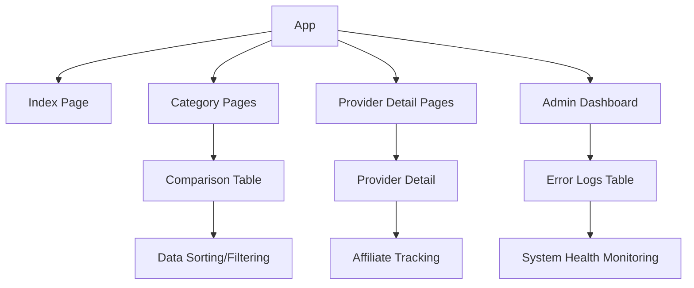
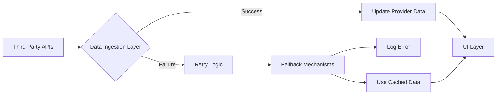

# Skygruppen Compare Pro - Technical Documentation

## Project Architecture

Skygruppen Compare Pro is a comprehensive comparison platform built with React, TypeScript, and Tailwind CSS. It allows users to compare providers across multiple categories including insurance, electricity, mobile plans, and loans.

### Core Components



## Data Flow

The application uses a self-healing data flow architecture:



## Self-Healing Mechanism

The platform implements a multi-layered self-healing strategy:

1. **Edge Function Layer**
   - Retry failed API calls up to 3 times with exponential backoff
   - Log detailed errors to the database for monitoring
   - Fall back to cached data when retries fail

2. **Frontend Layer**
   - React Query handles retries and caching automatically
   - Provides fallback UI components when data is unavailable
   - Image loading fallbacks with provider initials

3. **Database Layer**
   - Automated function to resolve stale errors
   - Daily maintenance to clean up error logs
   - Maintains database health

## Mobile Responsiveness

The application is designed to be fully responsive:
- Card-based layouts for mobile devices
- Table layouts for desktop views
- Adaptive navigation with hamburger menu on mobile
- Touch-friendly interface elements

## Provider Categories

### Insurance Providers
Includes If, Gjensidige, Tryg, Fremtind, Frende, Eika, Codan, Storebrand, WaterCircles, KLP

### Electricity Providers
Includes Tibber, Fjordkraft, Motkraft, Hafslund, Fortum, Ishavskraft, NorgesEnergi, Ustekveikja, LOS, Polar Kraft

### Mobile Plan Providers
Includes Telia, Telenor, Ice, OneCall, Talkmore, Chili Mobil, Happybytes, MyCall, Release, Nortel

### Loan Providers
Includes DNB, Nordea, Santander, Komplett Bank, Instabank, Bank Norwegian, yA Bank, Svea Finans, BN Bank, Ikano Bank

## Setup Instructions

1. Clone the repository
2. Install dependencies with `npm install`
3. Create a `.env.local` file with required environment variables:
   ```
   VITE_SUPABASE_URL=your_supabase_url
   VITE_SUPABASE_ANON_KEY=your_supabase_anon_key
   VITE_GOOGLE_VISION_API_KEY=your_google_vision_api_key
   ```
4. Run the development server with `npm run dev`

## Deployment

The application is designed to be deployed with Vercel:

1. Connect your repository to Vercel
2. Configure environment variables
3. Deploy the application

## Affiliate Tracking

The platform includes built-in affiliate tracking:
- All provider links include affiliate parameters
- Click events are logged for analytics
- Compliant with Norwegian marketing regulations

## Legal & Compliance

- GDPR compliant with proper user notices
- Clearly marked affiliate links
- Provider terms of use are stored and displayed

## Maintenance & Updates

- Daily provider data updates
- Weekly error log reviews
- Monthly performance optimizations

## Future Enhancements

- User login & personalized comparisons
- Deal alerts via SMS/email
- Advanced filtering options
- Provider API scorecard system
